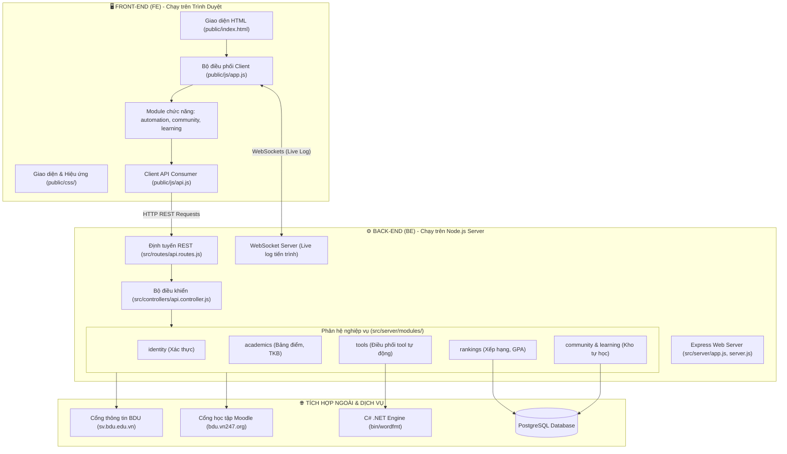

# 🧭 BẢN ĐỒ KIẾN TRÚC DỰ ÁN (PROJECT ARCHITECTURE & CODEBASE GUIDE)

> **Tài liệu phân định ranh giới Front-End (FE) và Back-End (BE)**, giải thích chi tiết cấu trúc thư mục, luồng dữ liệu và cách các thành phần trong hệ thống phối hợp với nhau.

---

## 📌 1. TỔNG QUAN HỆ THỐNG

Toàn bộ workspace hiện tại bao gồm 3 phân hệ chính:
1. **`bdu-tu-hoc/` (Dự án chính)**: Web App Full-stack (Node.js/Express + Vanilla JS/HTML/CSS + PostgreSQL). Đây là nơi chứa toàn bộ ứng dụng web đang vận hành cho sinh viên.
2. **`dinh dang word/` (Engine C# .NET)**: Mã nguồn C# xử lý sâu vào file `.docx` (OpenXML) theo đúng chuẩn tiểu luận & đồ án tốt nghiệp BDU. Engine này được biên dịch thành binary CLI đặt tại `bdu-tu-hoc/bin/wordfmt/` để Backend gọi khi người dùng upload file word.
3. **`auto-khao-sat/` (Tool Python)**: Phiên bản desktop GUI chạy bằng Python hỗ trợ auto đánh giá khảo sát giảng viên (bản tiền thân / độc lập).

---

## 🏗️ 2. SƠ ĐỒ KIẾN TRÚC TỔNG THỂ



---

## 🎨 3. PHẦN FRONT-END (FE) — CLIENT-SIDE

> **Vị trí**: Toàn bộ thư mục `bdu-tu-hoc/public/`

Front-End được xây dựng theo phong cách **Vanilla JavaScript hiện đại, Single Page Application (SPA)**, không dùng framework nặng (không React/Vue), giúp tải trang tức thì, hiệu năng mượt mà và tối ưu tài nguyên tối đa.

### 📁 Chi tiết các tệp và thư mục Front-End:

| Đường dẫn | Vai trò | Chức năng cụ thể |
| :--- | :--- | :--- |
| **`public/index.html`** | Khung giao diện chính | Chứa toàn bộ cấu trúc các view: Đăng nhập, Dashboard cá nhân, Bảng điểm chi tiết, Lịch học theo tuần, Bảng xếp hạng GPA, Kho tài liệu tự học, Modal công cụ tự động hóa. |
| **`public/admin-tool.html`** | Giao diện quản trị | Bảng điều khiển riêng cho admin để test, đồng bộ và kiểm tra trạng thái dữ liệu. |
| **`public/css/style.css`** | CSS Design System | Toàn bộ giao diện người dùng (Dark Theme hiện đại, thẻ card, bảng điểm responsive, thanh cuộn, modal, button). |
| **`public/css/login.css`** | CSS trang Đăng nhập | Hiệu ứng khung đăng nhập, hoạt ảnh character tương tác. |
| **`public/css/showcase.css`** | CSS hiệu ứng nâng cao | Parallax, pointer spotlight, container queries, animated counter, layout responsive. |
| **`public/js/app.js`** | Nhạc trưởng FE (Controller) | Lắng nghe sự kiện click/input, quản lý trạng thái (state) sinh viên, chuyển đổi qua lại giữa các tab, render dữ liệu bảng điểm/lịch học lên HTML. |
| **`public/js/api.js`** | Cầu nối gọi Backend | Đóng gói tất cả các hàm `fetch()` gửi request lên Server (`/api/login`, `/api/scores`, `/api/schedule`, `/api/rankings`,...). |
| **`public/js/features/`** | Các module nghiệp vụ (Lazy-load) | Tách nhỏ code để tăng tốc độ tải trang ban đầu: |
| ↳ `automation.js` | Tính năng Tự động hóa | Xử lý giao diện kéo thả file Word, kết nối WebSocket nghe log tiến trình Auto khảo sát & Auto Moodle. |
| ↳ `community.js` | Tính năng Cộng đồng | Xử lý bài đăng, bình luận, hỏi đáp và chia sẻ link tài liệu học tập theo mã môn. |
| ↳ `learning.js` | Tính năng Kho môn học | Danh sách môn học đã học / đang học, bộ lọc và tìm kiếm theo môn. |
| **`public/js/core/`** | Hạ tầng tải tài nguyên FE | `resource-loader.js`, `style-loader.js`, `view-lifecycle.js`: Quản lý nạp CSS/JS động và vòng đời các màn hình. |
| **`public/js/interactions.js`** | Vi tương tác UX | Phím tắt (`Ctrl/Cmd + K` mở thanh tìm kiếm nhanh), âm thanh, vi chuyển động. |
| **`public/assets/`** | Tài nguyên media | Logo trường BDU, icons, ảnh minh họa, âm thanh giao diện. |

---

## ⚙️ 4. PHẦN BACK-END (BE) — SERVER-SIDE

> **Vị trí**: Các thư mục `bdu-tu-hoc/src/`, `server.js`, `scripts/`, `migrations/`, `bin/`

Back-End chạy trên nền tảng **Node.js (Express.js)**, đóng vai trò làm trung gian bảo mật (Proxy / Gateway) giữa trình duyệt sinh viên với Cổng thông tin BDU, hệ thống Moodle, Database PostgreSQL và Engine xử lý Word.

### 📁 Chi tiết các tệp và thư mục Back-End:

| Đường dẫn | Vai trò | Chức năng cụ thể |
| :--- | :--- | :--- |
| **`server.js`** | Điểm khởi chạy (Entry) | File chạy đầu tiên khi gõ `npm start` hoặc `node server.js`. |
| **`src/server/app.js`** | Cấu hình Express App | Khai báo middlewares (CORS, body parser, cookie parser, serve thư mục tĩnh `public/`), bảo vệ chống tràn tải và đăng ký các routes. |
| **`src/server/bootstrap.js`** | Khởi động dịch vụ | Kết nối DB PostgreSQL, khởi tạo WebSocket Server cho Live Terminal Log, lên lịch chạy định kỳ (cron job lúc 03:00 sáng đồng bộ xếp hạng). |
| **`src/routes/api.routes.js`** | Danh bạ Endpoint API | Định nghĩa tất cả URL API: `/api/login`, `/api/logout`, `/api/scores`, `/api/schedule`, `/api/tools/...`. |
| **`src/controllers/api.controller.js`** | Bộ xử lý nghiệp vụ chính | Nhận request từ routes, kiểm tra dữ liệu đầu vào, gọi các module nghiệp vụ và trả kết quả JSON về cho FE. |
| **`src/server/modules/`** | Các khối xử lý logic nghiệp vụ | Tách biệt theo Domain-Driven Design: |
| ↳ `identity/` | Quản lý phiên | Xác thực tài khoản sinh viên BDU, duy trì token / cookie phiên an toàn. |
| ↳ `academics/` | Học tập & Điểm số | Xử lý dữ liệu bảng điểm môn học, tính điểm tích lũy, phân loại học lực, định dạng thời khóa biểu. |
| ↳ `rankings/` | Xếp hạng & Vinh danh | Tính toán thứ hạng GPA theo lớp, khoa, viện và toàn trường. |
| ↳ `community/` & `learning/` | Chia sẻ tài nguyên số | CRUD bài viết chia sẻ tài liệu học tập, lưu vết link Drive/YouTube gắn với từng mã môn. |
| ↳ `tools/` | Điều phối công cụ | Nhận file Word từ FE chuyển sang `bin/wordfmt` xử lý; kích hoạt worker chạy Auto đánh giá giảng viên & Auto giải Moodle. |
| **`src/integrations/`** | Cầu nối ra bên ngoài | Giao tiếp với các hệ thống trường học: |
| ↳ `bdu/` | Tích hợp Cổng BDU | Đóng giả trình duyệt (crawler/proxy) gửi request đến `sv.bdu.edu.vn`, giải mã session cookie, parse HTML/JSON trả về từ trường. |
| ↳ `moodle/` | Tích hợp Moodle | Đăng nhập `bdu.vn247.org`, duyệt danh sách câu hỏi trắc nghiệm, đối chiếu ngân hàng đáp án cục bộ. |
| **`src/db/` & `migrations/`** | Cơ sở dữ liệu | Cấu hình PostgreSQL Pool, lưu trữ dữ liệu snapshot điểm để xếp hạng và nội dung bài đăng chia sẻ. |
| **`bin/wordfmt/`** | Binary thực thi C# | File thực thi được gọi trực tiếp bằng `child_process` trong Node.js để format Word siêu tốc. |
| **`scripts/`** | Tiện ích bảo trì hệ thống | Migration DB (`migrate.js`), sao lưu/phục hồi DB (`db-dump.js`, `db-restore.js`), nén và minify CSS/JS trước khi deploy (`compress-public-assets.mjs`). |

---

## 🔄 5. LUỒNG HOẠT ĐỘNG THỰC TẾ (DATA FLOW WORKFLOW)

### Trường hợp 1: Sinh viên Đăng nhập & Xem Bảng điểm
1. **[FE]**: Sinh viên nhập MSSV và Mật khẩu tại màn hình `public/index.html`.
2. **[FE]**: `public/js/api.js` gửi `POST /api/login` lên Back-End.
3. **[BE]**: `src/controllers/api.controller.js` chuyển qua `src/integrations/bdu/` để gửi request xác thực tới cổng trường `sv.bdu.edu.vn`.
4. **[BE]**: Nhận kết quả thành công, Backend lưu session cookie và trả về thông tin sinh viên cho FE.
5. **[FE]**: `public/js/app.js` chuyển sang Dashboard và gọi tiếp `GET /api/scores`.
6. **[BE]**: Lấy điểm từ BDU, tính toán GPA và đối chiếu bảng xếp hạng trong DB PostgreSQL rồi trả JSON về.
7. **[FE]**: `public/js/app.js` render giao diện bảng điểm và hiển thị huy hiệu xếp hạng.

### Trường hợp 2: Chuẩn hóa Word BDU (WordFmt)
1. **[FE]**: Sinh viên kéo thả file `.docx` vào mục WordFmt (`public/js/features/automation.js`).
2. **[FE]**: Gửi file kèm các tùy chọn bìa qua `POST /api/tools/format-word`.
3. **[BE]**: `multer` nhận file lưu vào thư mục `temp/`.
4. **[BE]**: `src/server/modules/tools/` gọi binary CLI `bin/wordfmt/wordfmt.exe` với các tham số tương ứng.
5. **[C# Engine]**: Đọc OpenXML, chỉnh lề 2-2-3-2 cm, đổi Times New Roman 13, chuẩn hóa Heading H1-H4, tạo mục lục tự động, xuất ra file kết quả.
6. **[BE]**: Trả file đã format về trình duyệt cho sinh viên tải xuống tự động.

---

## 🛠️ 6. BẠN NÊN CHỈNH SỬA Ở ĐÂU? (DEVELOPMENT GUIDE)

- **Nếu muốn sửa giao diện (màu sắc, nút bấm, font chữ, bố cục hiển thị)**:
  👉 Sửa trong `public/index.html` và `public/css/style.css` (hoặc `public/css/login.css` cho màn login).
- **Nếu muốn sửa logic hiển thị trên web (click nút này thì hiện bảng kia, lọc điểm, popup...)**:
  👉 Sửa trong `public/js/app.js` hoặc các file tính năng tương ứng trong `public/js/features/`.
- **Nếu muốn sửa API, thêm endpoint mới hoặc thay đổi cách lưu dữ liệu**:
  👉 Sửa trong `src/routes/api.routes.js` và `src/controllers/api.controller.js`.
- **Nếu muốn sửa thuật toán cào dữ liệu điểm, lịch học BDU hoặc sửa Moodle**:
  👉 Sửa trong `src/integrations/bdu/` hoặc `src/integrations/moodle/`.
- **Nếu muốn sửa quy chuẩn canh lề, font chữ, format bìa Word**:
  👉 Sửa trong project C# `dinh dang word/src/WordFmt.Core/` rồi build đè binary vào `bdu-tu-hoc/bin/wordfmt/`.

---

## ⚖️ 7. ĐÁNH GIÁ KIẾN TRÚC: NÊN GIỮ NGUYÊN HAY TÁCH RA JSX / COMPONENT ROUTING (`/gpa`, `/info`, `/schedule`...)?

### 1. Phân tích bối cảnh hiện tại
* **Thực trạng**: Toàn bộ UI hiện nằm trong **1 file `index.html` duy nhất (~130 KB)** và file logic **`app.js` (~119 KB)**. Các tab như Bảng điểm, Lịch học, Thông tin cá nhân, Công cụ... được chuyển đổi qua lại bằng cách ẩn/hiện DOM trong cùng 1 trang (Single Monolithic DOM).
* **Câu hỏi đặt ra**: *Việc để cấu trúc như này ổn định hơn, hay tách ra thành các file JSX riêng biệt với routing sạch (`/gpa`, `/info`, `/schedule`...) sẽ tốt hơn?*

---

### 📊 2. Bảng so sánh chi tiết: Cấu trúc hiện tại vs Tách thành JSX / Component Routing

| Tiêu chí | Cấu trúc Hiện tại (Monolithic Vanilla HTML/JS) | Cấu trúc Tách JSX (React/Vite/Next.js Routing) |
| :--- | :--- | :--- |
| **Độ ổn định khi vận hành nhỏ lẻ** | 🟢 **Rất cao**: Không lo lỗi build pipeline, không phụ thuộc Vite/Webpack, không sợ hydration mismatch. | 🟡 **Khá**: Đòi hỏi quy trình build CI/CD hoặc chạy Vite build trước khi đưa lên production. |
| **Độ phức tạp khi bảo trì (Maintainability)** | 🔴 **Kém khi dự án phình to**: Muốn sửa 1 nút bảng điểm phải cuộn tìm trong `index.html` (hơn 3000 dòng). Rất dễ sửa nhầm DOM của section khác. | 🟢 **Rất cao**: Mỗi trang là 1 file độc lập (`GpaPage.jsx`, `SchedulePage.jsx`). Sửa GPA chỉ sửa đúng file GPA, tách biệt hoàn toàn. |
| **Khả năng làm việc nhóm (Teamwork)** | 🔴 **Rất dễ xung đột (Merge conflict)**: 2 người cùng code giao diện chắc chắn sẽ conflict nặng nề trong `index.html` hoặc `app.js`. | 🟢 **Xuất sắc**: Mỗi người phụ trách 1 Component/Route trong các folder riêng biệt. |
| **Trải nghiệm URL (Deep Linking & SEO)** | 🔴 **Hạn chế**: Không thể gõ thẳng `domain.com/gpa` để vào ngay bảng điểm; F5 reload lại trang thường bị đưa về trạng thái mặc định. | 🟢 **Chuẩn mực Web**: Người dùng có thể bookmark link `domain.com/gpa` hoặc gửi link lịch học `/schedule` cho bạn bè. |
| **Tốc độ tải trang ban đầu (Initial Load)** | 🟡 **Trung bình**: Phải tải toàn bộ 130KB HTML + 380KB CSS + 120KB JS ngay lần đầu truy cập dù chỉ muốn xem thời khóa biểu. | 🟢 **Rất nhanh (Code-splitting)**: Chỉ tải đúng bundle JS/CSS của trang đang xem (ví dụ chỉ tải 30KB cho `/schedule`). |
| **Độ linh hoạt & Tái sử dụng (Reusability)** | 🔴 **Thấp**: Bảng điểm, card sinh viên, modal... bị gắn cứng trong DOM, khó mang sang dự án khác hoặc tái sử dụng. | 🟢 **Rất cao**: Tạo các component dùng chung như `<StudentCard />`, `<GradeBadge />`, `<TerminalLog />` dùng ở bất kỳ đâu. |
| **Chi phí chuyển đổi (Migration Cost)** | 🟢 **0 đồng**: Đang chạy sẵn, không tốn công sức làm lại. | 🔴 **Tốn thời gian ban đầu**: Cần viết lại logic DOM manipulation trong `app.js` thành React State/Hooks (`useState`, `useEffect`). |

---

### 🏛️ 3. Mô hình cấu trúc thư mục nếu tách sang JSX (Khuyến nghị chuẩn)

Nếu chuyển đổi sang mô hình JSX (dùng **Vite + React** hoặc **Next.js**), cấu trúc FE sẽ trở nên chuyên nghiệp và dễ quản lý vượt trội:

```text
frontend/ (hoặc client/)
├── src/
│   ├── main.jsx                   # Entrypoint React
│   ├── App.jsx                    # Root Layout & Router Config
│   ├── routes.jsx                 # Khai báo URL: /, /gpa, /info, /schedule, /tools...
│   ├── api/                       # API Services (gọi BE Node.js)
│   │   ├── auth.api.js
│   │   ├── grades.api.js
│   │   └── schedule.api.js
│   ├── components/                # Component tái sử dụng
│   │   ├── common/                # Button, Modal, LoadingSkeleton, Navbar, Sidebar
│   │   └── terminal/              # LiveTerminalLog (cho Auto Khảo sát & Moodle)
│   ├── pages/                     # Tách riêng biệt từng màn hình (JSX)
│   │   ├── login/
│   │   │   ├── LoginPage.jsx
│   │   │   └── login.module.css
│   │   ├── gpa/
│   │   │   ├── GpaPage.jsx        # Giao diện xem điểm & xếp hạng (/gpa)
│   │   │   ├── GradeTable.jsx
│   │   │   └── GpaRankChart.jsx
│   │   ├── info/
│   │   │   └── ProfilePage.jsx    # Thông tin lý lịch sinh viên (/info)
│   │   ├── schedule/
│   │   │   ├── SchedulePage.jsx   # Thời khóa biểu tuần (/schedule)
│   │   │   └── CalendarGrid.jsx
│   │   ├── tools/
│   │   │   ├── WordFmtTool.jsx    # Chuẩn hóa Word BDU (/tools/wordfmt)
│   │   │   ├── SurveyAutoTool.jsx # Auto khảo sát (/tools/survey)
│   │   │   └── MoodleAutoTool.jsx # Auto bài tập Moodle (/tools/moodle)
│   │   └── community/
│   │       ├── CourseHubPage.jsx  # Kho tài liệu theo môn (/community)
│   │       └── PostCard.jsx
│   └── styles/                    # Global CSS, variables, themes
```

---

### 🎯 4. KẾT LUẬN & LỜI KHUYÊN TỪ CHUYÊN GIA

1. **Nếu dự án hiện tại là đồ án cá nhân / đã sắp xong / chỉ cần chạy ngay**:
   * 👉 **Nên GIỮ NGUYÊN cấu trúc hiện tại**: Vì dự án đã được tối ưu hóa nén Brotli (`.br`), phân tách module `features/` và đang hoạt động ổn định. Chuyển đổi ngay lúc này sẽ mất nhiều ngày refactor và dễ phát sinh lỗi hiệu ứng giao diện (parallax, CSS showcase, âm thanh).

2. **Nếu dự án dự định phát triển lâu dài, mở rộng thêm nhiều tính năng hoặc có nhóm cùng làm**:
   * 👉 **RẤT NÊN TÁCH THÀNH JSX VỚI ROUTING RIÊNG (`/gpa`, `/info`, `/schedule`)**:
     * Đây là **chuẩn mực kiến trúc công nghiệp**.
     * Giúp sinh viên có thể chia sẻ link trực tiếp: ví dụ gửi link `bdu.edu.vn/schedule` để bạn bè xem TKB tuần, hoặc bookmark trang điểm.
     * Codebase sạch sẽ, không còn "nỗi sợ" khi mở file `index.html` 130KB hay `app.js` hơn 100KB để tìm 1 đoạn code cần sửa.

3. **Lộ trình chuyển đổi mượt mà (Nếu quyết định tách)**:
   * **Bước 1**: Giữ nguyên toàn bộ Back-End (`src/`, `server.js`, `integrations/`). Back-End không cần sửa gì vì vốn dĩ đã là REST API chuẩn (`/api/...`).
   * **Bước 2**: Khởi tạo thư mục `client/` với Vite (`npm create vite@latest client -- --template react`).
   * **Bước 3**: Cắt từng block giao diện từ `index.html` sang các Component JSX tương ứng (`GpaPage.jsx`, `SchedulePage.jsx`).
   * **Bước 4**: Sử dụng `react-router-dom` để định tuyến các đường dẫn `/gpa`, `/schedule`, `/tools`.
   * **Bước 5**: Cấu hình Express Backend để fallback mọi route không thuộc `/api/` về `client/dist/index.html`.

---
*Tài liệu được cập nhật tự động theo phiên bản cấu trúc hiện tại của dự án BDU Tự Học.*
